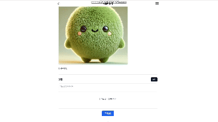
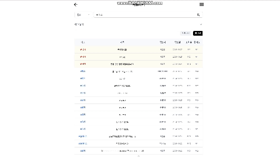

# Fitquest_indiv

## Directory for Refactoring

### FitQuest Git README.md ✅

 
  

 

## 📝 소개
FitQuest는 나만의 운동 플래너를 만들어 활동 기록을 채우고 다른 사람들과 운동 관련 소통을 할 수 있는 종합 운동 커뮤니티 플랫폼

 

### 기능 소개

방명록, 팔로워, 팔로잉 목록

카테고리 추가

todo 추가

todo 날짜 옮기기

todo 옮기기, 수정, 삭제

todo 추가

사용자 설정 페이지

일반글 작성

공지글 작성

게시글 수정, 삭제

댓글

검색

유저 검색

비디오 홈

 

## 🗂️ APIs

👉🏻 API 바로보기

 

사용자 활동 API

 

| 기능 | URL | Method | 설명 | 응답코드 |
|------|-----|---------|------|---------|
| 연간 활동 데이터 조회 | `/api/activity/{year}/{userId}` | GET | 특정 연도의 사용자 활동 데이터(완료된 todo 비율)를 조회합니다 | 200: 조회 성공 404: 데이터를 찾을 수 없음 500: 서버 오류 |
| 일일 활동 데이터 갱신 | `/api/activity/daily/{date}/{userId}` | PUT | 특정 날짜의 사용자 활동 데이터를 갱신합니다 | 200: 갱신 성공 500: 서버 오류 |

검색 API

 

| 기능 | URL | Method | 설명 | 응답코드 |
|------|-----|---------|------|---------|
| 네이버 블로그 검색 | `/api/article/search/blog` | GET | 네이버 블로그 검색 API를 통해 블로그 검색을 수행합니다 | 200: 블로그 검색 성공 400: 검색어 인코딩 실패 |
| 네이버 이미지 검색 | `/api/article/search/image` | GET | 네이버 이미지 검색 API를 통해 이미지 검색을 수행합니다 | 200: 이미지 검색 성공 400: 검색어 인코딩 실패 |
| 유튜브 동영상 검색 | `/api/article/search/video` | GET | 유튜브 동영상 검색 API를 통해 동영상 검색을 수행합니다 | 200: 동영상 검색 성공 400: 검색어 인코딩 실패 |
| 유튜브 플레이리스트 비디오 검색 | `/api/article/playlist/videos` | GET | 유튜브 플레이리스트 비디오 검색 API를 통해 플레이리스트 비디오 검색을 수행합니다 | 200: 플레이리스트 비디오 검색 성공 400: 검색어 인코딩 실패 |

게시판 API

 

| 기능 | URL | Method | 설명 | 응답코드 |
|------|-----|---------|------|---------|
| 전체 게시글 조회 | `/api/board` | GET | 검색 조건에 따른 전체 게시글 목록을 조회합니다 | 200: 조회 성공 204: 데이터 없음 500: 서버 오류 |
| 특정 게시글 조회 | `/api/board/{id}` | GET | 게시글 ID로 특정 게시글을 조회합니다 | 200: 조회 성공 204: 게시글 없음 500: 서버 오류 |
| 게시글 작성 | `/api/board` | POST | 새로운 게시글을 작성합니다 | 201: 게시글 생성 성공 400: 잘못된 요청 500: 서버 오류 |
| 게시글 수정 | `/api/board/{id}` | PUT | 기존 게시글을 수정합니다 | 200: 수정 성공 404: 게시글 없음 500: 서버 오류 |
| 게시글 삭제 | `/api/board/{id}` | DELETE | 게시글을 삭제합니다 | 200: 삭제 성공 404: 게시글 없음 500: 서버 오류 |
| 게시글 검색 | `/api/board/search` | POST | 검색 조건에 맞는 게시글을 검색합니다 | 200: 검색 성공 204: 검색 결과 없음 500: 서버 오류 |
| 게시글 이미지 업로드 | `/api/board/{boardId}/post-image` | POST | 게시글에 이미지를 업로드합니다 | 200: 업로드 성공 500: 서버 오류 |
| 게시글 이미지 조회 | `/api/board/uploads/posts/{filename}` | GET | 업로드된 게시글 이미지를 조회합니다 | 200: 이미지 조회 성공 404: 이미지 없음 |
| 검색 기록 저장 | `/api/board/history` | POST | 사용자의 검색 기록을 저장합니다 | 200: 저장 성공 500: 서버 오류 |
| 검색 기록 조회 | `/api/board/history/{userId}/{content}` | GET | 특정 사용자의 검색 기록을 조회합니다 | 200: 조회 성공 500: 서버 오류 |

카테고리 API

 

| 기능 | URL | Method | 설명 | 응답코드 |
|------|-----|---------|------|---------|
| 카테고리 목록 조회 | `/api/category/{userId}` | GET | 특정 사용자의 모든 카테고리를 조회합니다 | 200: 조회 성공 404: 카테고리 없음 500: 서버 오류 |
| 특정 카테고리 조회 | `/api/category/{userId}/{categoryId}` | GET | 특정 사용자의 특정 카테고리를 조회합니다 | 200: 조회 성공 404: 카테고리 없음 500: 서버 오류 |
| 카테고리 추가 | `/api/category/{userId}` | POST | 새로운 카테고리를 추가합니다 | 200: 추가 성공 500: 서버 오류 |
| 카테고리 수정 | `/api/category/{categoryId}` | PUT | 기존 카테고리를 수정합니다 | 200: 수정 성공 500: 서버 오류 |
| 카테고리 삭제 | `/api/category/{categoryId}` | DELETE | 특정 카테고리를 삭제합니다 | 200: 삭제 성공 500: 서버 오류 |

댓글 API

 

| 기능 | URL | Method | 설명 | 응답코드 |
|------|-----|---------|------|---------|
| 게시글 댓글 목록 조회 | `/api/comment/board/{boardId}` | GET | 특정 게시글의 모든 댓글을 조회합니다 | 200: 조회 성공 204: 댓글 없음 500: 서버 오류 |
| 특정 댓글 조회 | `/api/comment/detail/{id}` | GET | 댓글 ID로 특정 댓글을 조회합니다 | 200: 조회 성공 204: 댓글 없음 500: 서버 오류 |
| 댓글 작성 | `/api/comment` | POST | 새로운 댓글이나 대댓글을 작성합니다 | 201: 작성 성공 400: 잘못된 요청 500: 서버 오류 |
| 댓글 삭제 | `/api/comment/{id}` | DELETE | 특정 댓글을 삭제 처리합니다 | 200: 삭제 성공 500: 서버 오류 |

팔로우 API

 

| 기능 | URL | Method | 설명 | 응답코드 |
|------|-----|---------|------|---------|
| 팔로워 목록 조회 | `/api/follow/followers/{userId}` | GET | 사용자의 팔로워 목록을 조회합니다 | 200: 조회 성공 204: 팔로워 없음 500: 서버 오류 |
| 팔로잉 목록 조회 | `/api/follow/followings/{userId}` | GET | 사용자의 팔로잉 목록을 조회합니다 | 200: 조회 성공 204: 팔로잉 없음 500: 서버 오류 |
| 팔로잉 상태 조회 | `/api/follow/status/{followerId}/{followingId}` | GET | 사용자의 팔로잉 상태를 조회합니다 | 200: 조회 성공 500: 서버 오류 |
| 팔로우 | `/api/follow` | POST | 사용자를 팔로우합니다 | 200: 팔로우 성공 500: 서버 오류 |
| 언팔로우 | `/api/follow/{followerId}/{followingId}` | DELETE | 사용자를 언팔로우합니다 | 200: 언팔로우 성공 500: 서버 오류 |

방명록 API

 

| 기능 | URL | Method | 설명 | 응답코드 |
|------|-----|---------|------|---------|
| 방명록 목록 조회 | `/api/guestbook/{targetId}` | GET | 사용자의 방명록 목록을 조회합니다 | 200: 조회 성공 204: 방명록 없음 500: 서버 오류 |
| 방명록 등록 | `/api/guestbook` | POST | 방명록을 등록합니다 | 200: 등록 성공 400: 등록 실패 500: 서버 오류 |
| 방명록 삭제 | `/api/guestbook/{guestbookId}` | DELETE | 방명록을 삭제합니다 | 200: 삭제 성공 400: 삭제 실패 500: 서버 오류 |

좋아요 API

 

| 기능 | URL | Method | 설명 | 응답코드 |
|------|-----|---------|------|---------|
| 좋아요 토글 | `/api/hit/{boardId}/{userId}` | POST | 게시글의 좋아요를 추가하거나 제거합니다 | 200: 토글 성공 500: 서버 오류 |
| 좋아요 수 조회 | `/api/hit/count/{boardId}` | GET | 특정 게시글의 전체 좋아요 수를 조회합니다 | 200: 조회 성공 500: 서버 오류 |
| 좋아요 상태 확인 | `/api/hit/status/{boardId}/{userId}` | GET | 특정 사용자가 특정 게시글에 좋아요를 했는지 확인합니다 | 200: 조회 성공 500: 서버 오류 |

할 일 API

 

| 기능 | URL | Method | 설명 | 응답코드 |
|------|-----|---------|------|---------|
| 일별 할 일 목록 조회 | `/api/todo/{date}/{userId}` | GET | 특정 날짜와 사용자의 모든 할 일 목록을 조회합니다 | 200: 조회 성공 404: 데이터 없음 500: 서버 오류 |
| 할 일 추가 | `/api/todo` | POST | 새로운 할 일을 추가합니다 | 200: 추가 성공 404: 추가 실패 500: 서버 오류 |
| 할 일 수정 | `/api/todo/{id}` | PUT | 기존 할 일의 정보를 수정합니다 | 200: 수정 성공 404: 할 일을 찾을 수 없음 500: 서버 오류 |
| 연간 통계 조회 | `/api/todo/statistics/{year}` | GET | 특정 연도의 할 일 통계를 조회합니다 | 200: 조회 성공 404: 데이터 없음 500: 서버 오류 |
| 특정 할 일 조회 | `/api/todo/{id}` | GET | ID로 특정 할 일을 조회합니다 | 200: 조회 성공 404: 할 일을 찾을 수 없음 500: 서버 오류 |
| 할 일 삭제 | `/api/todo/{id}` | DELETE | 특정 할 일을 삭제합니다 | 200: 삭제 성공 404: 할 일을 찾을 수 없음 500: 서버 오류 |
| 월별 할 일 목록 조회 | `/api/todo/{userId}/{year}/{month}` | GET | 특정 연도와 월의 할 일 목록을 조회합니다 | 200: 조회 성공 404: 데이터 없음 500: 서버 오류 |
| 카테고리별 할 일 목록 조회 | `/api/todo/list/{categoryId}/{userId}` | GET | 특정 카테고리의 모든 할 일 목록을 조회합니다 | 200: 조회 성공 404: 데이터 없음 500: 서버 오류 |
| 완료한 할 일 수 조회 | `/api/todo/count/{userId}` | GET | 특정 사용자의 완료한 할 일 수를 조회합니다 | 200: 조회 성공 404: 데이터 없음 500: 서버 오류 |

사용자 API

 

| 기능 | URL | Method | 설명 | 응답코드 |
|------|-----|---------|------|---------|
| 랜덤 사용자 조회 | `/api/user/random` | GET | 랜덤한 사용자를 조회합니다 | 200: 조회 성공 404: 사용자를 찾을 수 없음 500: 서버 오류 |
| 회원가입 | `/api/user/regist` | POST | 새로운 사용자를 등록합니다 | 201: 가입 성공 400: 잘못된 요청 500: 서버 오류 |
| 로그인 | `/api/user/login` | POST | 사용자 인증 후 토큰을 발급합니다 | 200: 로그인 성공 401: 인증 실패 500: 서버 오류 |
| 토큰 갱신 | `/api/user/refresh` | POST | 만료된 액세스 토큰을 리프레시 토큰으로 갱신합니다 | 200: 토큰 갱신 성공 401: 유효하지 않은 리프레시 토큰 500: 서버 오류 |
| 로그아웃 | `/api/user/logout` | POST | 사용자의 리프레시 토큰을 무효화합니다 | 200: 로그아웃 성공 500: 서버 오류 |
| 닉네임 중복 확인 | `/api/user/check-name/{name}` | GET | 닉네임 사용 가능 여부를 확인합니다 | 200: 사용 가능한 닉네임 409: 중복된 닉네임 500: 서버 오류 |
| 이메일 중복 확인 | `/api/user/check-email/{email}` | GET | 이메일 사용 가능 여부를 확인합니다 | 200: 사용 가능한 이메일 409: 중복된 이메일 500: 서버 오류 |
| 사용자 정보 조회 | `/api/user/{userId}` | GET | 특정 사용자의 상세 정보를 조회합니다 | 200: 조회 성공 404: 사용자를 찾을 수 없음 500: 서버 오류 |
| 사용자 정보 수정 | `/api/user/{userId}` | PUT | 사용자의 프로필 정보를 수정합니다 | 200: 수정 성공 400: 잘못된 요청 500: 서버 오류 |
| 리프레시 토큰 확인 | `/api/user/check-refresh-token` | GET | 리프레시 토큰의 존재 여부를 확인합니다 | 200: 확인 성공 |
| 프로필 이미지 업로드 | `/api/user/{userId}/profile-image` | POST | 사용자의 프로필 이미지를 업로드합니다 | 200: 업로드 성공 500: 서버 오류 |
| 프로필 이미지 조회 | `/api/user/uploads/profiles/{filename}` | GET | 업로드된 프로필 이미지를 조회합니다 | 200: 조회 성공 404: 이미지를 찾을 수 없음 |
| 사용자 검색 | `/api/user/search` | POST | 사용자 이름으로 검색합니다 | 200: 조회 성공 204: 검색 결과가 없음 |
| 관리자 권한 확인 | `/api/user/admin/{userId}` | GET | 사용자의 관리자 권한 여부를 확인합니다 | 200: 확인 성공 401: 인증 실패 500: 서버 오류 |

챗봇 API

 

| 기능 | URL | Method | 설명 | 응답코드 |
|------|-----|---------|------|---------|
| AI 응답 생성 | `/api/chatbot/ai/generate` | GET | OpenAI API를 사용하여 응답을 생성합니다 | 200: 응답 생성 성공 500: 서버 오류 |
| 운동 추천 생성 | `/api/chatbot/workout/recommend/{userId}` | GET | 사용자의 카테고리와 목표에 따라 운동 추천을 생성합니다 | 200: 운동 추천 생성 성공 404: 사용자 없음 500: 서버 오류 |

 

## ⚙ 기술 스택
### Back-end

### Front-end

### Library

### Tools

 

 

 

## 💁‍♂️ 프로젝트 팀원
|  |  |
|:---:|:---:|
|[배성훈](https://github.com/baehoonbae)|[임채준](https://github.com/dlacowns21)
|유저, 투두, 카테고리, 팔로우, 활동, 외부 API 관련 기능|게시판, 댓글, 조회수, 좋아요, 검색 관련 기능, 기술 문서 작성|

## 커밋 메시지

`feat`: 새로운 기능 추가

`fix`: 버그 수정

`docs`: 문서 수정

`style`: 코드 포맷팅

`refactor`: 코드 리팩토링

`test`: 테스트 코드

`chore`: 빌드 업무 수정
